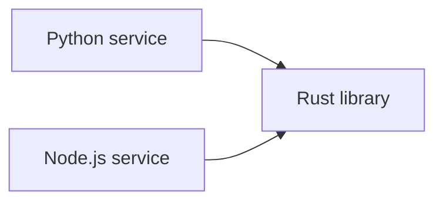

# Keep Building the Ship
*The Ship of Theseus and Software Engineering*

When an existing system needs to change, the safest and easiest path is usually to replace it one meaningful part at a time.
That approach preserves the capabilities that users and other systems already rely on while allowing the implementation to evolve.

> Existing systems contain more knowledge than the team remembers.

A working system contains more than its visible source files.
It contains data relationships, operational knowledge, integrations, tests, deployment procedures, and expectations that users have built around it.
Those parts interact, so the value of the whole system exceeds the sum of the value of the parts.
A rewrite can reproduce the obvious features and still lose the less visible relationships that make the system dependable.

Greenfield work can be appropriate, but it starts without the production history that taught the existing system how to behave.
Building in situ lets each change preserve what still works while making room for what the product needs next.

## Ship of Theseus

The Ship of Theseus asks whether a ship remains the same ship after its parts have been replaced one by one.
Software has the same question in a practical form.
We can replace a database, change a service, rewrite a user interface, and move parts of the system to another language over several years.
At the end, very little of the original implementation may remain.

The system can still be considered the same system when it continues to meet the promises that define it.
Those promises include the behavior users depend on, the interfaces other systems call, the data the business needs, and the operational guarantees the team has committed to provide.
Tests make those promises visible enough to preserve while the components change.

## Let Tests Define the Contract

Tests should describe the behavior a system must keep while its implementation changes.
Before a major redesign, strengthen the tests around the capabilities that users and other teams depend on.
The tests then give the team a way to change internals without relying on memory or on a comparison with an implementation that will disappear.

End-to-end tests are especially important when a user interface depends on a service.
An integration test can exercise the request between the UI and the service, while an end-to-end test can follow a user-visible workflow through the browser, API, application logic, and persistence layer.
For example, a useful test might sign in, search for an existing record, and verify that the result appears in the interface after the service returns it.
That test protects the contract across the boundaries that a user experiences.

A brittle test checks details that the contract does not promise.
It may call a private helper directly, assert an exact DOM structure when only the visible result matters, or replace every collaborator with a mock so that no real boundary is exercised.
Those tests can pass while the workflow is broken.
Good tests still use unit tests for local rules, but they also test the important boundaries with realistic inputs and outputs.

Test-driven development helps turn requirements into executable constraints before an implementation settles.
When the current system changes in place, the tests expose regressions.
When a new codebase becomes necessary, the same tests can guide the replacement.

Tests should preserve deliberate promises rather than accidental behavior.
That distinction lets a migration keep product value while removing historical quirks that the product no longer needs.

## Use Libraries as Bridges

A new project can be justified by a fundamentally different architecture, runtime model, framework, or deployment boundary.
Even in those cases, teams can move the shared capability first and postpone the larger migration.

Extract the capability into a library.
Use it from the existing system.
Exercise it with production traffic and tests.
Refine its interface while real callers depend on it.
If a new application becomes necessary, the application can reuse a component that already has operational evidence supporting it.

For example, a Rust library can package sensitive logic behind a stable interface and expose bindings to multiple host languages.
Rust is a great option for this approach when the shared capability needs performance, memory safety, or a stable native implementation.
The host systems can remain in their existing languages while both call the same library through an appropriate interface.

The language matters less than the boundary.
The boundary lets the team improve a core capability without requiring every surrounding system to move at the same time.

## Microservices as Bridges

A service boundary can provide a similar bridge when a library cannot cross the required runtime or ownership boundary.
The existing application can call a new service through a stable API while the new implementation is developed and deployed independently.

A network call introduces latency, failure modes, monitoring requirements, and deployment work.
Those costs can be worthwhile when the boundary allows a gradual rollout.
The new service can receive a small amount of traffic, have its results compared with the existing implementation, and be rolled back without replacing the whole application.

The boundary also makes switching implementations more straightforward.
Callers depend on the API rather than on the service's internal language, framework, or data structures.
Once the new service satisfies the same contract, configuration or routing can direct more traffic to it.
The team can remove the old implementation after the new one has earned enough operational confidence.

Libraries and services make different tradeoffs.
A library keeps calls in process and should have lower latency.
A service offers stronger deployment and ownership boundaries.
Both can help a team replace one part of a system without asking the entire system to start over.

## Do Not Rewrite for an Org Chart

[Conway's Law](https://en.wikipedia.org/wiki/Conway%27s_law) describes how a system's structure tends to reflect the communication structure of the organization that builds it.
That relationship can explain an architectural problem, but a team should not create a new codebase solely because a different team will own the work.

The first question should be which boundary the product and the code require.
If ownership needs to become explicit, one repository can still provide clear folders, APIs, and review responsibility.
GitHub's [`CODEOWNERS`](https://docs.github.com/en/repositories/managing-your-repositorys-settings-and-features/customizing-your-repository/about-code-owners) file can assign people or teams to paths and can participate in required reviews when branch protection enables that rule.
That makes ownership visible without splitting a working system prematurely.

Libraries and SDKs provide a stronger boundary when a component needs its own release cadence or a stable public interface.
They carry versioning and compatibility costs, so those costs should correspond to a real boundary in the product or the organization.

## Start Fresh When Fundamentals Change

Starting fresh makes sense when the existing foundation prevents the product from meeting a fundamental new requirement.
A new framework, a different interaction model, a hard deployment separation, or a major change in data ownership can make adaptation more expensive than replacement.
The decision should follow from those constraints rather than from the appeal of tabula rasa, a clean repository.
A project started with the intent to be a cleaner version of an existing one will face the same challenges as the original system and will make invalid assumptions
which will increase its complexity over time.
This results in a vicious cycle of repeated rewrites and increasing complexity of systems and tribal knowledge for the team.

## Conclusion

Changing programming languages alone should not decide the question.
Teams can integrate a new language through a library, service, or narrow execution boundary while keeping the surrounding system in place.
The relevant question is what capabilities the new language or framework provide and whether those capabilities require a new application right now.

The practical choice is to evolve the current system until evidence shows that it cannot become what the product needs.
That evidence should come from technical and product constraints, supported by tests and operational experience.
